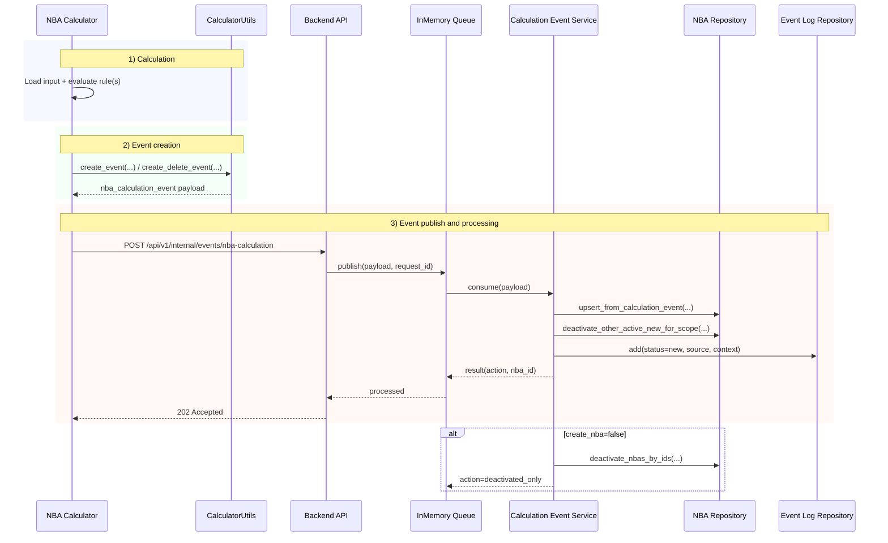

# HOGENT NBA Backend

Python backend for a Next Best Action platform using an in-memory database and in-process queue.

## Run

```bash
python -m venv .venv
source .venv/bin/activate
pip install -e .
uvicorn nba_backend.main:app --reload
```

Base URL: `http://127.0.0.1:8000`

## Auth headers

There are no request headers for user scoping or authorization.

## API

- `GET /api/v1/nba?account_id=...` or `GET /api/v1/nba?enterprise_number=...`
- `POST /api/v1/nba/{nba_id}/actions`
- `POST /api/v1/internal/events/nba-calculation` (helper endpoint to enqueue calculation events)
- `GET /api/v1/mock-db/overview` (loaded mock table counts)

Recalculation behavior:
- When a new calculation event creates a `new` NBA for the same scope (`nba_definition_id` + target identifiers), older active `new` NBAs in that same scope are marked `active=false`.

Docs:
- Swagger UI: `/docs`
- OpenAPI: `/openapi.json`
- Mini frontend: `/ui/active-nbas`

### Mini frontend: active NBAs per client

Open:

```bash
http://127.0.0.1:8000/ui/active-nbas?client=0123456789
```

Switch client directly in the URL by changing `client=<enterprise_number>`.
The page fetches active NBAs (`status=new`) via `GET /api/v1/nba`.

## Mock DB integration

At startup, the backend loads mock JSON tables from `examples/mock_db` by default.

- Override location with env var: `MOCK_DB_DIR`
- Startup log prints loaded row counts
- Calculation events are enriched with known `account_id`/`enterprise_number` pairs from mock users when one identifier is missing

## Logging and traceability

The backend logs each step so you can follow an event flow from API to queue worker.

- Correlation header: `X-Request-Id` (optional; auto-generated if missing)
- Key log markers:
  - `api.enqueue_event`
  - `api.enqueued_event`
  - `queue.consume`
  - `calc.nba_upserted`
  - `queue.processed`

### NBA event posting sequence



Example request with correlation id:

```bash
curl -X POST http://127.0.0.1:8000/api/v1/internal/events/nba-calculation \
  -H 'X-Request-Id: demo-trace-001' \
  -H 'Content-Type: application/json' \
  -d '{
    "event_id": "9f6849e6-6110-4bd8-8397-a8f9a6ec7d5a",
    "occurred_at": "2026-02-09T13:59:00Z",
    "source": "calculator.customer-segmentation.v1",
    "nba_definition_id": "def_42",
    "account_id": "acc_123"
  }'
```

You can then grep by request id:

```bash
uvicorn nba_backend.main:app --reload 2>&1 | tee app.log
rg "demo-trace-001" app.log
```

## Quick demo

1. Enqueue an event:

```bash
curl -X POST http://127.0.0.1:8000/api/v1/internal/events/nba-calculation \
  -H 'Content-Type: application/json' \
  -d '{
    "event_id": "9f6849e6-6110-4bd8-8397-a8f9a6ec7d5a",
    "occurred_at": "2026-02-09T13:59:00Z",
    "source": "calculator.customer-segmentation.v1",
    "nba_definition_id": "def_42",
    "account_id": "acc_123",
    "enterprise_number": "0123456789",
    "contact_id": "con_456",
    "context": {"score": 0.92, "reason": "high upsell propensity"}
  }'
```

2. Query NBAs:

```bash
curl 'http://127.0.0.1:8000/api/v1/nba?account_id=acc_123' \
  -H 'Accept: application/json'
```

3. Accept an NBA:

```bash
curl -X POST http://127.0.0.1:8000/api/v1/nba/<nba_id>/actions \
  -H 'Content-Type: application/json' \
  -d '{"status":"accepted"}'
```

## Calculator module

A simple income-based calculator is available under `src/nba_calculator`.

Rule:
- If `monthly_income > 2000`, emit an `nba_calculation_event` to sell `optimization`.

Input formats supported:
- Mapping format:
```json
{
  "0123456789": 3200,
  "1111111111": 1800
}
```
- List format:
```json
[
  {"enterprise_number": "0123456789", "monthly_income": 3200, "account_id": "acc_123"},
  {"enterprise_number": "1111111111", "monthly_income": 1800}
]
```